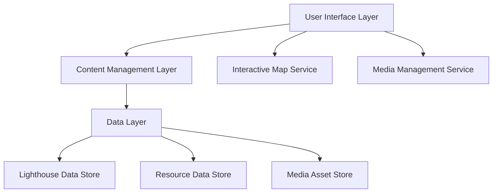

# Design Document

## Overview

The Hong Kong Lighthouses website will be built as a modern, responsive web application focusing on interactive content delivery and scholarly presentation. The architecture emphasizes performance, accessibility, and maintainability while providing rich interactive experiences through mapping technology and multimedia content.

## Architecture

### High-Level Architecture



### Technology Stack

**Frontend:**
- React.js with TypeScript for component-based architecture
- Next.js for server-side rendering and routing
- Tailwind CSS for responsive design system
- Framer Motion for smooth animations

**Mapping:**
- Mapbox GL JS for interactive mapping (preferred for customization)
- Alternative: Google Maps API (if Mapbox licensing is an issue)

**Content Management:**
- Markdown-based content with frontmatter for lighthouse data
- Static site generation for performance
- Git-based content versioning

**Hosting & Performance:**
- Vercel or Netlify for static hosting
- CDN for image optimization
- Progressive Web App (PWA) capabilities

## Components and Interfaces

### Core Components

#### 1. Interactive Map Component
```typescript
interface LighthouseMapProps {
  lighthouses: Lighthouse[]
  selectedLighthouse?: string
  onLighthouseSelect: (id: string) => void
  viewMode: 'full' | 'embedded'
}
```

**Features:**
- Custom lighthouse markers with heritage status indicators
- Smooth zoom and pan interactions
- Popup information windows
- Mobile touch gesture support
- Accessibility keyboard navigation

#### 2. Lighthouse Detail Component
```typescript
interface LighthouseDetailProps {
  lighthouse: Lighthouse
  relatedLighthouses: Lighthouse[]
  showNavigation: boolean
}
```

**Features:**
- Image gallery with lightbox functionality
- Heritage status badge display
- Historical timeline visualization
- Cross-references to resources and other lighthouses

#### 3. Resource Browser Component
```typescript
interface ResourceBrowserProps {
  resources: Resource[]
  categories: ResourceCategory[]
  searchEnabled: boolean
}
```

**Features:**
- Category-based filtering
- Search functionality
- Link validation status indicators
- Citation format display

#### 4. Navigation System
```typescript
interface NavigationProps {
  currentSection: string
  lighthouseCount: number
  isMobile: boolean
}
```

**Features:**
- Responsive hamburger menu for mobile
- Breadcrumb navigation
- Section progress indicators
- Quick lighthouse access dropdown

### Layout System

#### Desktop Layout
- Header with main navigation
- Sidebar for secondary navigation (lighthouse list, filters)
- Main content area with flexible grid system
- Footer with resource links and credits

#### Mobile Layout
- Collapsible header with hamburger menu
- Full-width content sections
- Bottom navigation for key actions
- Swipe gestures for lighthouse browsing

## Data Models

### Lighthouse Model
```typescript
interface Lighthouse {
  id: string
  name: string
  chineseName?: string
  location: {
    latitude: number
    longitude: number
    address: string
  }
  heritage: {
    status: 'declared_monument' | 'grade_3_historic' | 'none'
    year?: number
    description?: string
  }
  history: {
    built: number
    architect?: string
    purpose: string
    timeline: TimelineEvent[]
  }
  technical: {
    height?: number
    range?: number
    lightCharacteristic?: string
    currentStatus: 'active' | 'inactive' | 'automated'
  }
  media: {
    heroImage: string
    gallery: Image[]
    historicalImages?: Image[]
  }
  content: {
    description: string
    significance: string
    currentCondition: string
    visitingInfo?: string
  }
}
```

### Resource Model
```typescript
interface Resource {
  id: string
  title: string
  category: 'government' | 'academic' | 'book' | 'video' | 'other'
  url: string
  description: string
  author?: string
  publishDate?: string
  language: 'en' | 'zh' | 'both'
  status: 'active' | 'broken' | 'archived'
  relatedLighthouses: string[]
}
```

### Content Model
```typescript
interface EssayContent {
  id: string
  title: string
  sections: EssaySection[]
  lastUpdated: string
  references: Resource[]
}

interface EssaySection {
  heading: string
  content: string
  relatedLighthouses?: string[]
  images?: Image[]
}
```

## Error Handling

### Map Loading Errors
- Fallback to static image with lighthouse locations
- Graceful degradation to list view
- Retry mechanism for network failures
- User notification with alternative access methods

### Content Loading Errors
- Skeleton loading states during content fetch
- Error boundaries for component failures
- Offline content caching for PWA
- Fallback content for missing lighthouse data

### Image Loading Errors
- Progressive image loading with placeholders
- Fallback to default lighthouse silhouette
- Lazy loading for performance optimization
- Alt text for accessibility compliance

### External Resource Errors
- Link validation and status tracking
- Archived link alternatives where available
- User reporting mechanism for broken links
- Graceful handling of unavailable resources

## Testing Strategy

### Unit Testing
- Component rendering and interaction tests
- Data model validation tests
- Utility function tests
- Map interaction simulation tests

### Integration Testing
- End-to-end user journey tests
- Cross-browser compatibility tests
- Mobile device testing across screen sizes
- Performance testing for map interactions

### Content Testing
- Lighthouse data accuracy validation
- Resource link verification
- Image optimization and loading tests
- Accessibility compliance testing

### User Acceptance Testing
- Lighthouse enthusiast feedback sessions
- Navigation flow validation
- Content comprehensiveness review
- Mobile usability testing

## Performance Considerations

### Loading Optimization
- Code splitting by route and component
- Image optimization with WebP format
- Lazy loading for below-fold content
- Service worker for offline functionality

### Map Performance
- Marker clustering for dense areas
- Level-of-detail rendering
- Efficient re-rendering on zoom/pan
- Memory management for long sessions

### Content Delivery
- Static site generation for fast initial loads
- CDN distribution for global access
- Compression for text and image assets
- Caching strategies for dynamic content

## Accessibility Features

### Visual Accessibility
- High contrast mode support
- Scalable typography system
- Color-blind friendly color palette
- Focus indicators for keyboard navigation

### Interactive Accessibility
- Screen reader compatibility
- Keyboard navigation for all features
- ARIA labels for complex interactions
- Alternative text for all images

### Content Accessibility
- Semantic HTML structure
- Logical heading hierarchy
- Skip navigation links
- Language attributes for multilingual content